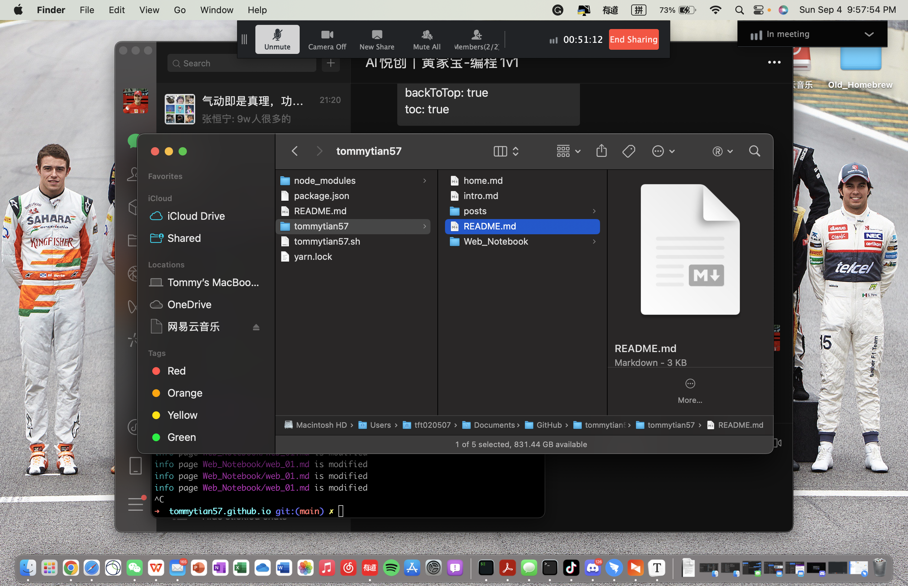

## 文章编写注意事项：

注意事项：想要写出开头的话输入三个减号按回车

日期生成网站：https://bornforthis.cn/python/index.html#/

运行网站

```yarn
yarn run docs:dev
```

部署网站

```yarn
sh tommytian57.sh
```

退出重新部署

```yarn
control+c
```

检查部署是否成功或者失败

1. 访问: [https://github.com/tommytian57/tommytian57.github.io](https://github.com/tommytian57/tommytian57.github.io)

```markdown
[https://github.com/tommytian57/tommytian57.github.io](https://github.com/tommytian57/tommytian57.github.io)
[链接名称](链接)
```

2. 插入图片



找一张图片（截图也可以）直接复制，点击允许创建文件夹后，图片即可出线，在小括号部分最前面插入./


老师的笔记

https://bornforthis.cn/1v1/04-TommyTian/01.html


