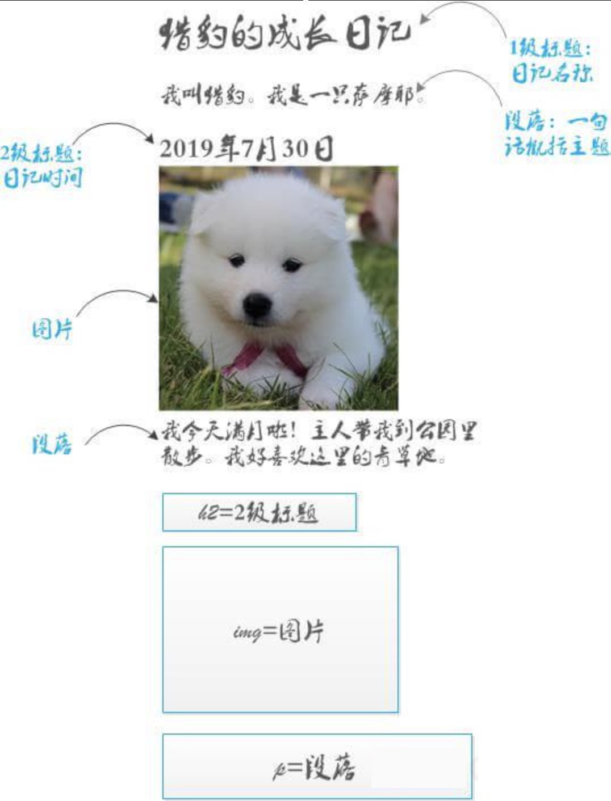
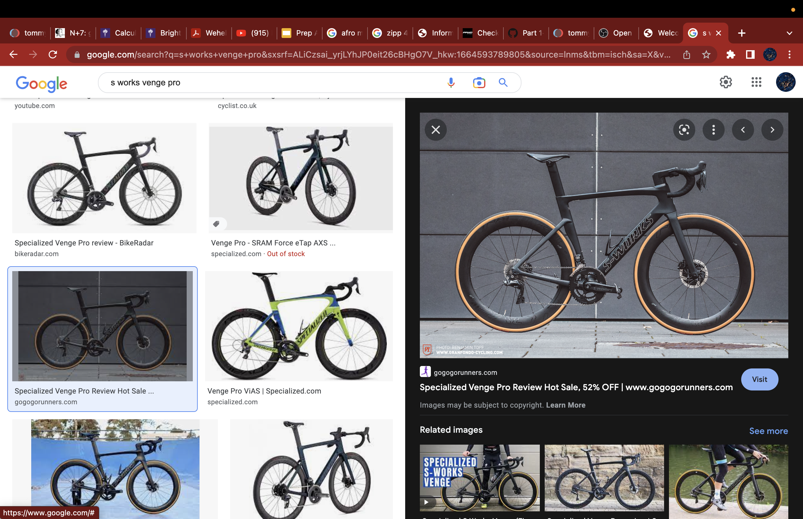
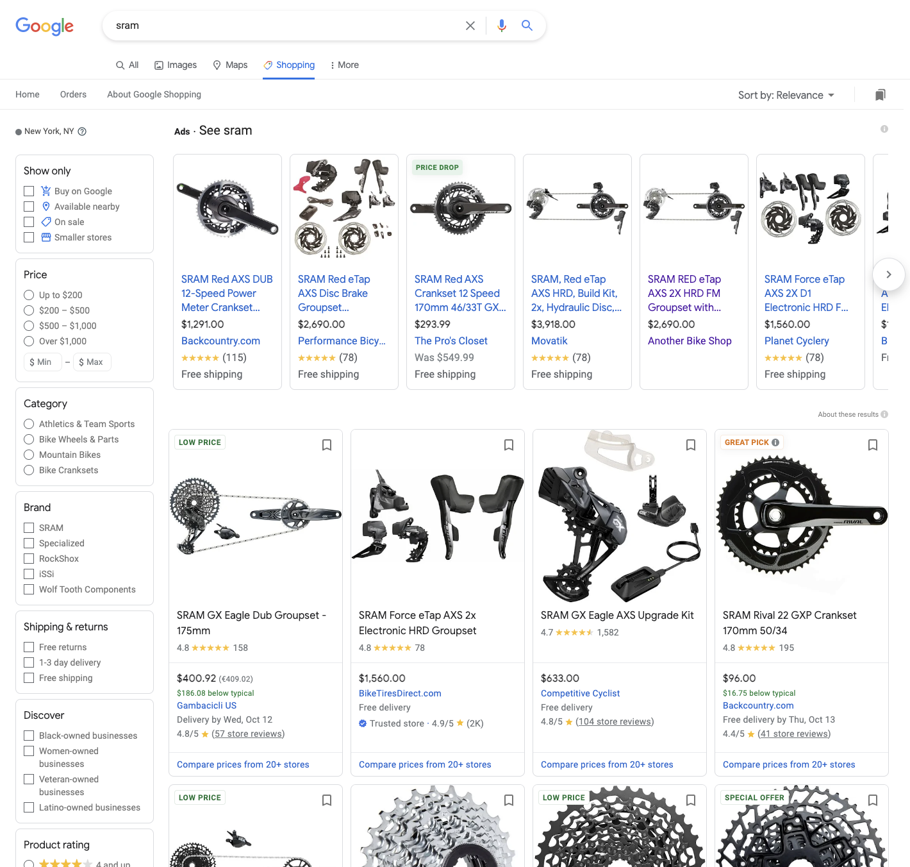

# 温故知新

1. N级标题的输入方法：N个井号空格输入题目，回车。

2. Web是万维网（World Wide Web）的简称，它建立在互联网上，为用户使用浏览器浏览信息的可视化界面。国内将这部分统称为前端。

​		HTML：超文本标记语言的简称，能够搭建网页内容，但是只能搭建毛胚网页。	

​		CSS：层叠样式表的英文简称，用来添加网页样式。能够改变网页上的字号，字体颜色，和背景图像是其更加		美观。

​		JavaScript：一种可添加网站交互效果的编程语言。使用它网页就动起来（按钮交互/动画），是网页有更多互		动效果（典型案例：苹果官网）。

# 学习web思想准备：

1. 最好使用**小写英文字母**命名文件格式，因为很多计算机和 web 服务器对大小写和中文敏感。
2. 文件名中**不要带有空格**，因为浏览器，web 服务器和编程语言对空格的理解和处理不同，为了不破坏网页链接我们不要用空格。这也是我们学习计算机一条不成文的规矩，要养成这个好习惯。
3. 文件名**一般用减号**。
4. **提前做好规划**：我们要做什么样的网页？先画好草图，即使大厂们都是先找产品经理画图然后再由工程师一步一步搭建的。画图的时候注意：考虑网页结构。
5. 

# Web

Web即World Wide Web， 全球广域网/万维网的英文简称。

换句话说，Web就是通过使用浏览器访问的各种资源。

这些资源包括：图片，表哥，链接，饮品，视频等。

上网浏览微博，上百度浏览图片，上b站看鬼畜，这些都是web提供技术支持。

如果web网页编写的足够好，他甚至能在手机或者网络电视上流畅显示。

# Web工作原理

我们上网看到的音视频/图片资源以文件的形式存放在web服务器上。

web服务器就像一台7*24小时持续作业的计算机，它为我们顺利上网而辛勤工作。

这些文件并不是随意堆放的，网页制作人在发布网站前，已经把各类资源进行规范分类和命名了。图片归入图片文件夹，样式归入样式文件夹，脚本归入脚本文件夹。

文件之间通过超文本编辑语言（HTML）建立联系，然后这些规范而合理的联系建立起来后，需要与服务器建立联系。

文件已主要分门别类地放：

图片，脚本，样式。

当我们想要浏览网页时，网页浏览器向服务器发出请求，只要服务器能在文件中找得到对应的资源，服务器都会把资源给浏览器。

那我们总结一下：网页文件的规范联系，浏览器的合理请求，服务器的正常运作，这就是web的工作.

Web工作流程，

1. 用户在浏览器点击资源并向服务器发出请求。
2. 服务器收到请求。
3. 服务器查找资源。
4. 服务器返回资源给浏览器。
5. 用户浏览想看的资源。

举个例子：

我是一名骑行爱好者，要组装自行车了。我在浏览器输入sram（著名自行车配件品牌），浏览器给了我各种卖该品牌的网上店铺的链接，也包括该品牌官网，这样我就可以挑选自己满意的配件下单了。

# Web文件路径

为了让服务器更快响应浏览器的请求，Web文件需要给服务器提供明确的路径。

比如：https://www.apple.com/iphone-14-pro/

iphone14pro隶属于apple.com。

路径中，iphone14pro和apple.com是父子关系，用斜杠隔开。

# 实战

开始实战作业之前，请先做好工具准备：

一个编译器，两款浏览器。

编译器：Notepad++或者VS Code

浏览器：谷歌或火狐

思考下列问题：你想通过网页展示什么内容，用什么资源的类型展示网页内容，你的网页布局像是怎么样的？

内容：批判法拉利F1车队的领队：马蒂亚比诺托

资源：网络上法拉利粉丝对他的声讨，网络上对他的评价，图片，表情包

页面布局：主页要有一个logo，文字，图片，链接等。

html标题：题目用`<h>`表示。`<h1>`至`<h6>`表示一到六级标题，逐渐变小。

html段落：段落用`
`表示。段落是文本，可以是词，句子，一段或几段的段落.

html图片：图片用``表示。图片格式可以是`png`, `jpg`, `svg`等。

