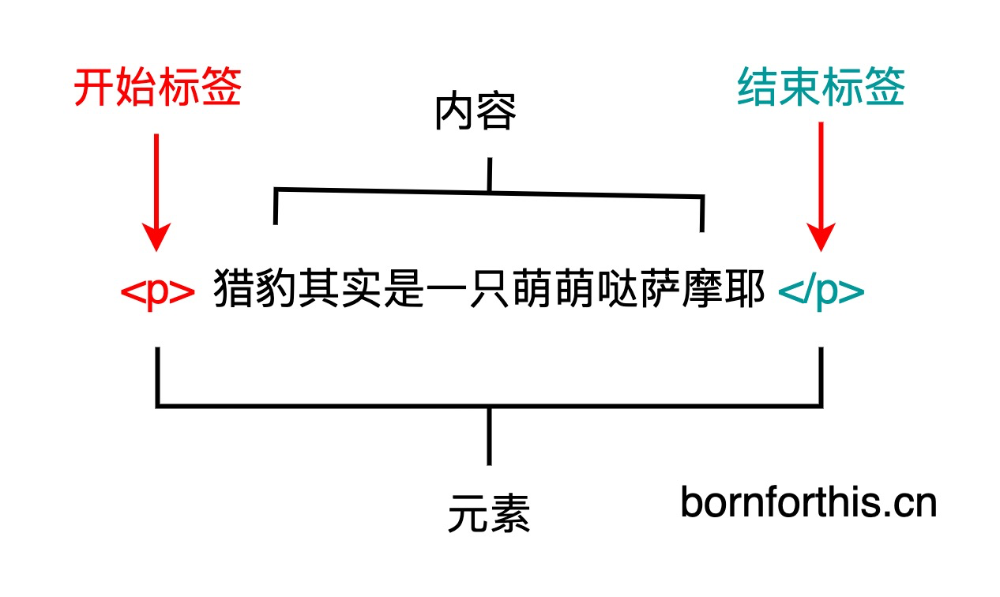
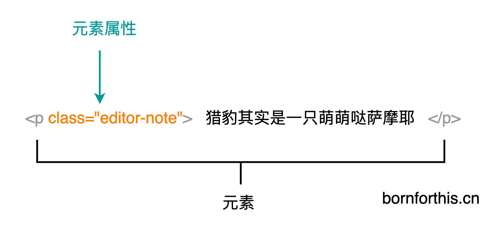
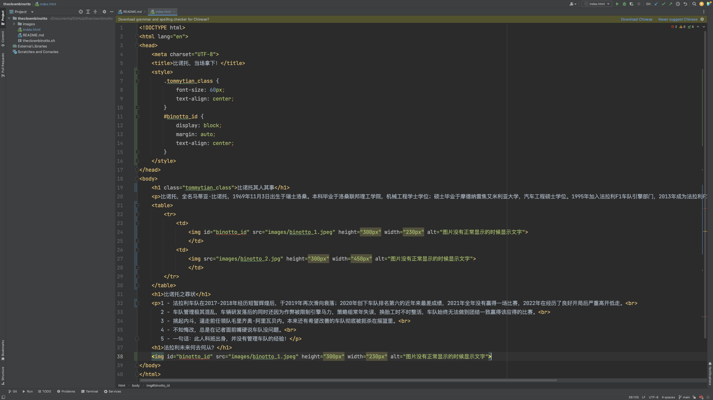
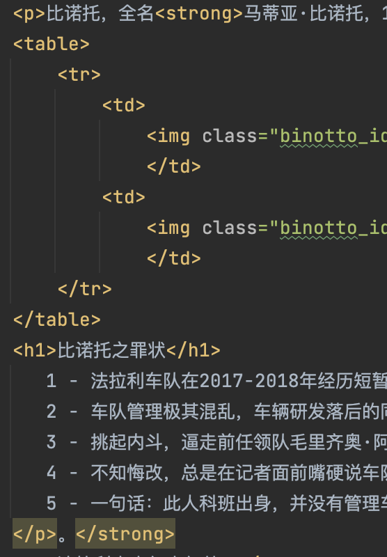
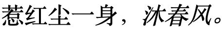

# 那么，HTML到底是什么？

HTML不是一门编程语言，而是一种标记语言。

HTML必须要有编码格式，不然在浏览器打开的时候容易显示乱码。

HTML主要需要记住标签和属性，标签的话网上有资源库可以随时查看。

## HTML的标签和元素：

我们可以得出结论：一个完整的元素 = 开始标签+ 内容+ 结束标签。

## 元素的属性：

属性是元素的额外信息，这些信息不会出现在网页的内容中。

元素属性必须包含：

1. 空格：元素和属性之间必须有一个空格。如果一个元素同时具有多个属性，属性之间也要用空格隔开。

2. 符号： 属性后面紧跟着一个等号。

3. 值：`“=”`后面必须有一个属性值，由一对引号包围。

   a. 必须在英文状态下输入引号。

   b. 可以是用双引号也可以使用单引号，但是单引号和双引号不能在同一个属性值里混用。

## Class的用法：

class和id的区别：class可以多次使用，而id只能使用一次。

## `<strong></strong>`

在`

`，也就是段落之间使用，将想要加粗的部分放在`<strong></strong>`之间可以获得加粗字体。

### 层叠顺序错误：

将`</strong>`放在`
`的外面的话，会将整个文本全部加粗，但是由于我们想要的只是部分加粗，所以这样是不可以的。

## `<em></em>:`

使用顺序同`<strong></strong>`，`<em></em>`的作用是展示写题文本。

strong和em均表示：着重阅读。

则我们可写出栗子：

`
惹红尘一身，<em>沐春风。</em>
`

